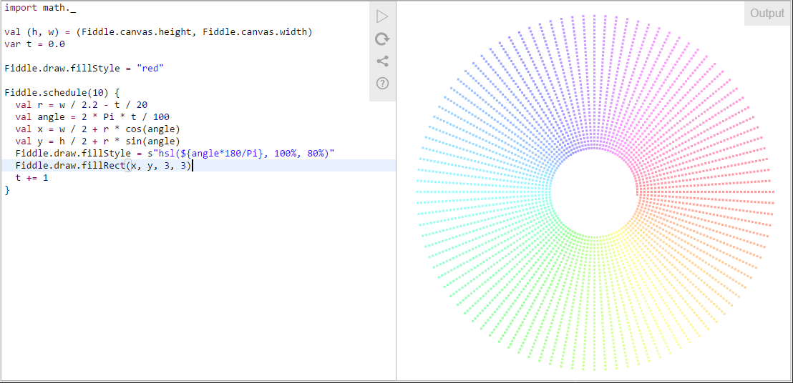

# Scala Fiddle - User's Guide

Scala Fiddle is an online playground for experimenting with Scala code snippets. This guide helps you in using the
features of the interactive fiddle environment.

The UI consists of two panes: the editor where you write your Scala code and the output panel showing the results of
running your code. On a small screen (mobile devices) the panes are on top of each other.
 


Scala Fiddle uses a standard [Ace editor](https://ace.c9.io/) providing syntax highlighting and some other basic editor
features.

## Basic functionality

The editor panel contains a group of buttons for accessing basic functionality. Depending on fiddle configuration, some
of the buttons may be hidden.

#### Compiling and Running code

To compile and run your code, click the triangle icon or press `Ctrl/Cmd-Enter` on your keyboard. Your code is sent to
the Scala Fiddle server which compiles it using [Scala.js](https://www.scala-js.org) and returns JavaScript code which
is then executed in the browser. In case there are errors in compilation, they are reported in the editor and in the
output panel.

If your code produces output using helper functions like `println`, the output will be visible on the right panel.

#### Reset the Fiddle

In case you want to reset the code to its original state, press the Reset button.

#### Sharing your Fiddle

To save your fiddle into a GitHub gist and share it, click on the Share button and choose "Create gist". You may also
share a link to the current fiddle, but your recent edits won't be visible unless you create a new gist.

#### Help

To access this user's guide, click on the help icon.

## Templates

Each fiddle is inside of a _template_ that defines what comes before and after your code. Typically the template defines
several `import`s and the `main` method that gets called when the fiddle is executed. The default template can be found
  below:
  
```scala
import scalatags.JsDom.all._
import org.scalajs.dom
import fiddle.Fiddle, Fiddle.println
import scalajs.js
object ScalaFiddle extends js.JSApp {
  def main() = {
// your fiddle code goes here!  
  }
}

```

You can view the full source code of your fiddle by pressing `Ctrl/Cmd-Alt-Enter` on the keyboard. The source code will
be prepared by the Scala Fiddle server and displayed in the output panel.

## Fiddle helpers

Scala Fiddle provides a helper class `Fiddle` containing useful functionality for producing output and controlling the
flow of your small application.

#### Printing text

To print lines of text, use the `println()` function. This works much like printing to a console. If you want to print
formatted text, use the `print()` function which takes ScalaTags as input. For example to print a header and a
paragraph, write:

```scala
print(h2("My header"), p("Lorem ipsum"))
```

#### Graphics

In addition to text output, your fiddle can also draw graphics on the provided canvas. Fiddle exposes a canvas rendering
context via `Fiddle.draw` and the underlying canvas via `Fiddle.canvas`. To draw, use the functionality provided by the
[rendering context](https://developer.mozilla.org/en/docs/Web/API/CanvasRenderingContext2D).

Example:
```scala
Fiddle.draw.fillStyle = "red"
Fiddle.draw.fillRect(0, 0, Fiddle.canvas.width / 2, Fiddle.canvas.height / 2)
```

#### Timers

Because JavaScript code is running in a single thread, you cannot create a "busy loop" in your code or else the browser
will become unresponsive. If you need to create long-running fiddles, you need to break it down into smaller parts and
use the provided scheduler to run your code.

`Fiddle.scheduleOnce(delay)(func)` runs the `func` once after `delay` milliseconds, whereas 
`Fiddle.schedule(interval)(func)` calls `func` every `interval` milliseconds.

The timers you create with these functions are automatically cleared when you recompile your code.