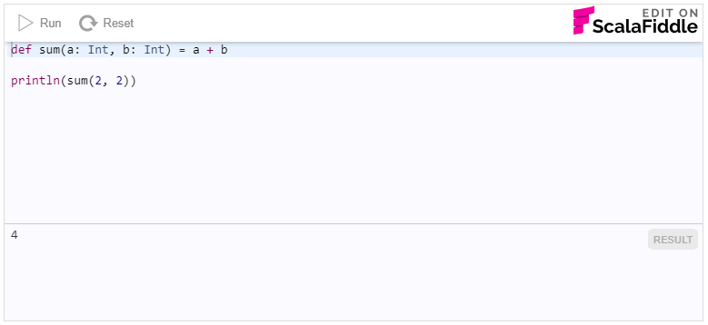

# ScalaFiddle integration

ScalaFiddle was built to be integrated from the very beginning. Before the fancy editor at 
[scalafiddle.io](https://scalafiddle.io) existed, there was a simpler, embeddable editor. So it has always been possible
to integrate a fiddle into your documentation using iframe embedding system. This has, however, been too complicated
for most users, which is why ScalaFiddle now comes with an easier integration scheme.

In addition to the base integration functionality provided by `integration.js` there are plugins for 
[Jekyll](jekyll) and [Gitbook](gitbook), that make it even easier to integrate ScalaFiddle into your documentation.

## `integration.js`

The base idea behind the integration system is to convert static code examples automatically into dynamic fiddles. To make
this happen, all you have to do is to wrap your existing code block with a single `<div>` and load the `integration.js` 
script. The integration works for both raw code and code that has been highlighted using HTML spans.

For example consider the following HTML with a `<pre>` block of code:

```html
<pre>
def sum(a: Int, b: Int) = a + b
</pre>
```

To make this into a integrated fiddle, simply wrap it with a `<div data-scalafiddle>`
```html
<div data-scalafiddle>
<pre>
def sum(a: Int, b: Int) = a + b

println(sum(2, 2))
</pre>
</div>
```
and load the `integration.js` script from scalafiddle.io

```html
<script defer src="https://embed.scalafiddle.io/integration.js"></script>
```

Note how we added a `println` statement to make the fiddle actually show some output. ScalaFiddle is not a REPL that would
automatically print the result/type of each executed statement.

When the integration script is executed, it looks for `div`s with a `data-scalafiddle` attribute and injects a Run button
into the top right corner of the code block.


When the user clicks the button, the code example is replaced with an editable fiddle which is automatically compiled and run.



### Integration parameters

To further customize the integrated fiddle you can supply additional parameters using `data-` attributes.

#### prefix

Prepend a single line of code before the fiddle, making it invisible to the user. Typical use case is prepending an `import`
statement. For example

```html
<div data-scalafiddle data-prefix="import scala.util.Random">
<pre>
println(Random.nextInt)
</pre>
</div>
```

#### dependency

Specify one or more library dependencies for the fiddle. The syntax for dependencies is `group %%% name % version`, 
for example

```html
<div data-scalafiddle 
  data-dependency="io.circe %%% circe-core % 0.8.0,io.circe %%% circe-generic % 0.8.0,io.circe %%% circe-parser % 0.8.0"
  data-prefix="import io.circe._, io.circe.generic.auto._, io.circe.parser._, io.circe.syntax._">
<pre>
case class Qux(i: Int, d: Option[Double])

val qux = Qux(13, Some(14.0))

println(qux.asJson.noSpaces)
</pre>
</div>
```

#### scalaversion

Select the Scala version for the fiddle. The default is 2.12.

```html
<div data-scalafiddle data-scalaversion="2.11">
<pre>
println("This is Scala 2.11!")
</pre>
</div>
```

#### template

Wrap the fiddle code in a template. The templates are defined in JavaScript (in `window.scalaFiddleTemplates`) before loading the `integration.js`. For example

```html
<div data-scalafiddle data-template="Circe">
<pre>
case class Qux(i: Int, d: Option[Double])

val qux = Qux(13, Some(14.0))

println(qux.asJson.noSpaces)
</pre>
</div>
<script>
window.scalaFiddleTemplates = {
  "Circe": {
    pre: "import io.circe._, io.circe.generic.auto._, io.circe.parser._, io.circe.syntax._\n" +
    "// $FiddleDependency io.circe %%% circe-core % 0.8.0\n" + 
    "// $FiddleDependency io.circe %%% circe-generic % 0.8.0\n" +
    "// $FiddleDependency io.circe %%% circe-parser % 0.8.0",
    post: ""
  }
}
</script>
```
In this example template we're also utilizing the special source code level encoding for dependencies supported by ScalaFiddle to define a
dependency on Circe version 0.8.0. The `post` part is left empty, but if it contained code, it would be appended _after_ the
user code block.

#### theme

Theme can be either `light` (the default) or `dark` if you prefer your fiddle code to have a dark background.

#### minheight

Define the minimum height for the embedded ScalaFiddle in pixels (default is 350). 

#### layout

Specify layout for the embedded fiddle. It can be either `v00` to `v99` or `h00` to `h99`, where `v` defines a vertical 
layout and `h` a horizontal one. The number specifies how much of the space is allocated for the editor (in percentages). The
defaule value is `v65` giving 65% of the vertical space to the editor and 35% to the result panel.

#### selector

Choose a different HTML tag to specify the code content (default is `pre`). Use this in case your code blocks are not 
contained in a `pre` block but something else. Can be any valid HTML selector.
