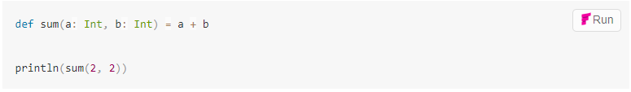
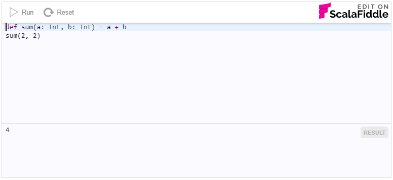

# Gitbook ScalaFiddle

Integrate ScalaFiddle easily into your Gitbook documentation using this plugin.

## Install

Add the below to your `book.json` file, then run `gitbook install` :

```json
{
  "plugins": ["scalafiddle"]
}
```

## Usage

The ScalaFiddle plugin provides a tag `scalafiddle` which you can use to convert a code block in your documentation into an
editable and runnable fiddle. Simply surround a code block with the tag as shown below.

Before:
````
```scala
def sum(a: Int, b: Int) = a + b

println(sum(2, 2))
```
````

After:
````

```scala
def sum(a: Int, b: Int) = a + b

println(sum(2, 2))
```

````

This will instruct the plugin to generate a special `<div>` around your code which will turn it into an editable fiddle when the
viewer clicks the `Run` button.



### Parameters

Each fiddle can be further customized with parameters. These parameters are described in more detail in the 
[main integration documentation](../README.md). For example:

````

````

### Templates

Each ScalaFiddle consists of a "user visible" part and of a template that is hidden from the user. You can use this template
code to provide additional or common functionality without cluttering each of your fiddles. A template can contain code that 
comes before the user code, or also code that comes afterwards (separated by a line starting with four slashes `////`).

The example template below wraps the user's code into a `{}` block, assigns it to a `val` and prints the result at the end.

```scala
val result = {
////
}
println(result)
```

Templates are stored by default under the `templates` directory (which can be changed via configuration). Each template must
have a `.scala` extension. For the example above, the correct file name would be `templates/Result.scala`

Use the template in documentation
````

```scala
def sum(a: Int, b: Int) = a + b
sum(2, 2)
```

````

You will see only the user defined code in the fiddle. The result pane, however, shows you that the template code was also
run.



The final code executed will actually be:

```scala
val result = {
def sum(a: Int, b: Int) = a + b
sum(2, 2)
}
println(result)
```

## Configuration

The ScalaFiddle plugin can be configured the same as any other Gitbook plugin via `book.json`. For example:

```json
  "pluginsConfig": {
    "scalafiddle": {
      "dependency": "io.suzaku %%% boopickle % 1.2.6",
      "scalaFiddleUrl": "http://localhost:8880/"
    }
  }
```

In the configuration you can provide default values for fiddle parameters such as `dependency`, `minheight`, `theme` etc.

You can also configure the location of templates with `templateDir` and the URL for the ScalaFiddle service (if you want to
run your own ScalaFiddle server, for example) using `scalaFiddleUrl`.
